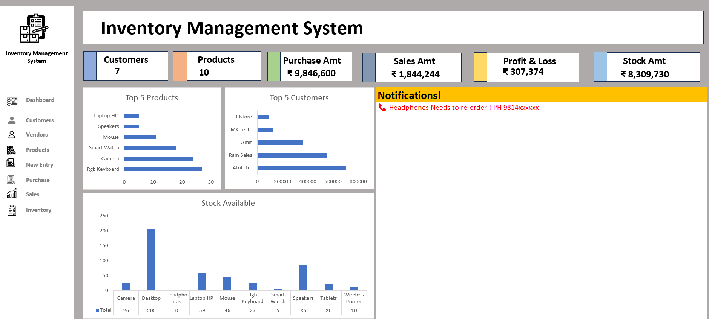
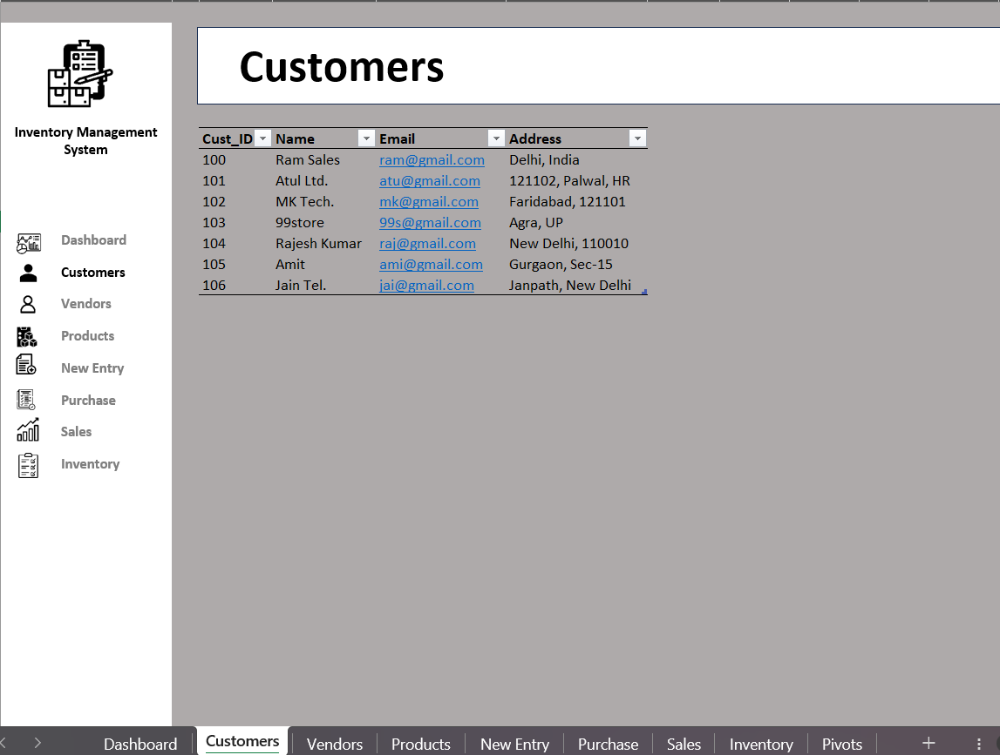
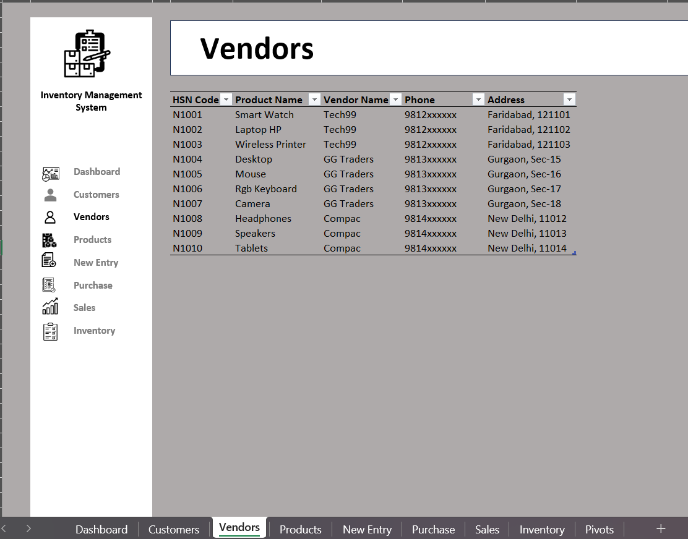
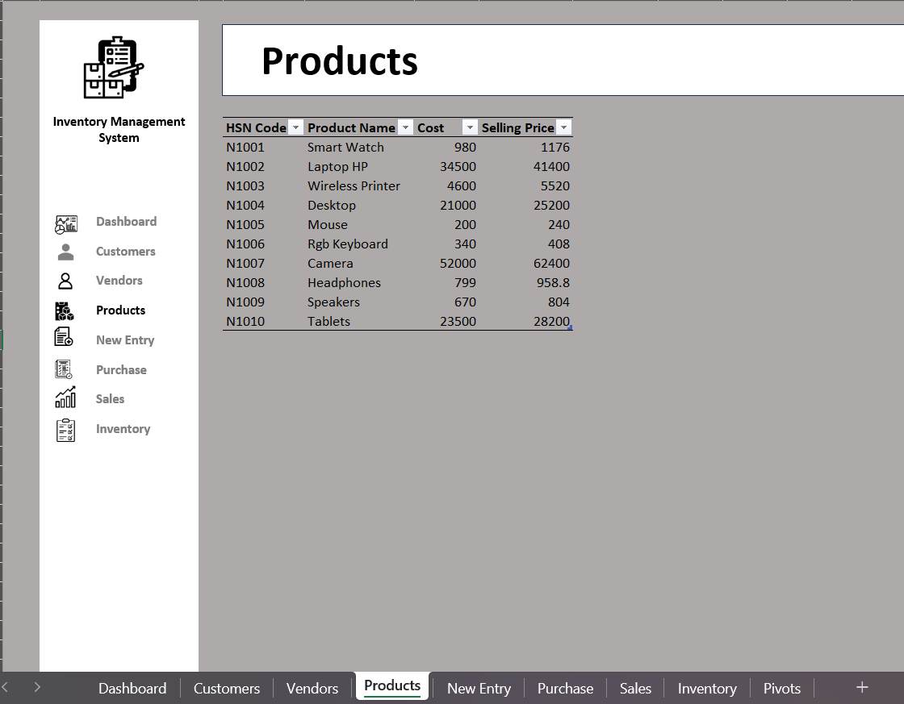
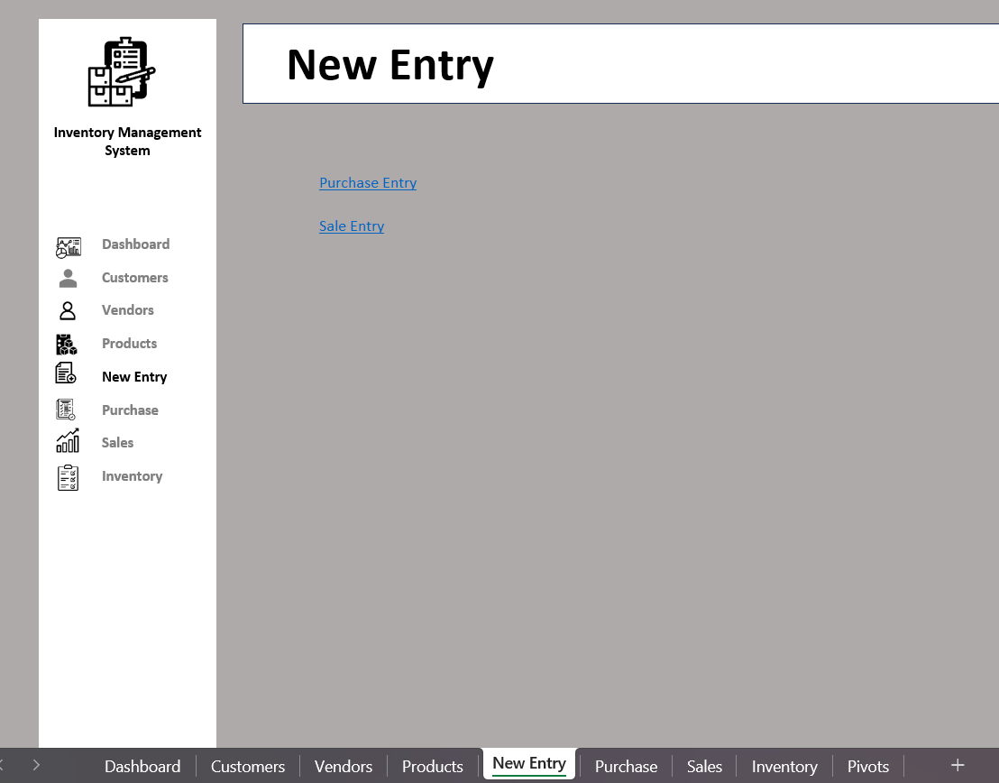
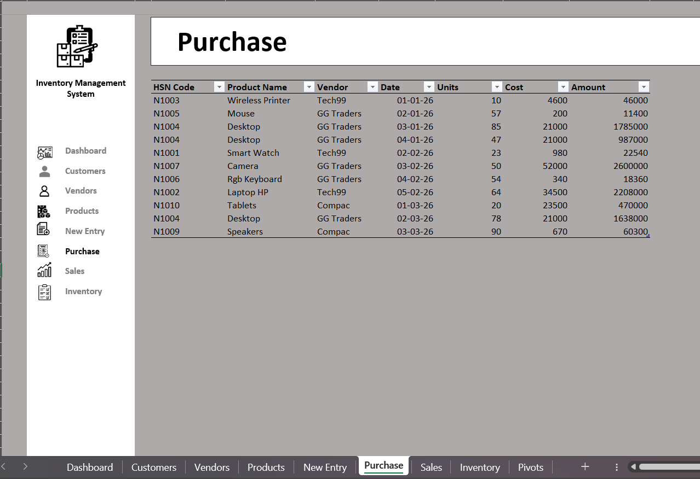
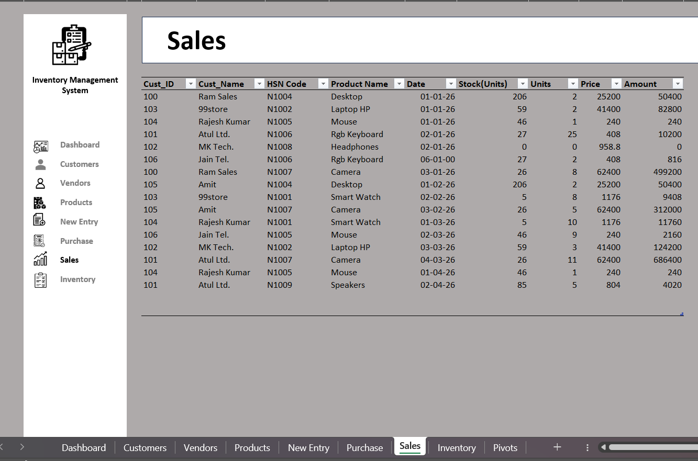
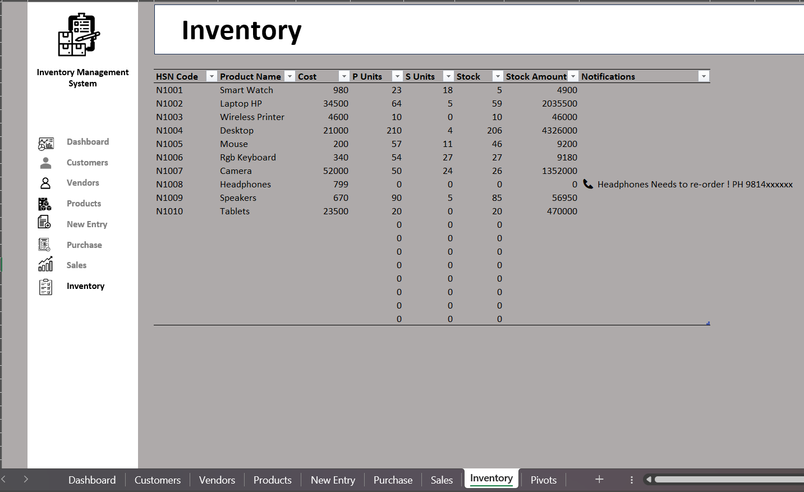

# 📦 Inventory Management System using Microsoft Excel

An interactive **Inventory Management System** built in **Microsoft Excel** to manage customers, vendors, products, purchases, sales and inventory efficiently. The project includes an interactive dashboard with KPIs, charts and low-stock notifications to provide valuable business insights.

---

## 📖 Project Overview

This project is designed to simplify inventory management for businesses by maintaining product records, purchase and sales transactions, stock availability and customer/vendor information in a single Excel workbook.

The dashboard provides real-time insights into inventory performance using Pivot Tables, Pivot Charts, Excel Formulas and Conditional Formatting.

---

# 🚀 Features

- 📊 Interactive Dashboard
- 👥 Customer Management
- 🏢 Vendor Management
- 📦 Product Management
- 🛒 Purchase Entry
- 💰 Sales Entry
- 📦 Inventory Tracking
- 📈 Profit & Loss Analysis
- 📉 Stock Availability
- 🚨 Automatic Low Stock Notification
- 🏆 Top 5 Products
- 🤝 Top 5 Customers
- 🔍 Filterable Data Tables
- 🔗 Hyperlinked Navigation Menu

---

# 📊 Dashboard KPIs

- Total Customers
- Total Products
- Purchase Amount
- Sales Amount
- Profit & Loss
- Current Stock Amount
- Top 5 Products
- Top 5 Customers
- Available Stock
- Re-order Notifications

---

# 🗂️ Workbook Structure

```
Inventory-Management-System-Excel
│
├── Dashboard
├── Customers
├── Vendors
├── Products
├── New Entry
├── Purchase
├── Sales
├── Inventory
└── Pivots
```

---

# 📸 Project Screenshots

## Dashboard

     

---

## Customers



---

## Vendors



---

## Products



---

## New Entry



---

## Purchase



---

## Sales



---

## Inventory



---

# 🛠️ Tools & Technologies Used

- Microsoft Excel
- Pivot Tables
- Pivot Charts
- Excel Formulas
- Conditional Formatting
- Data Validation
- Hyperlinks
- Dashboard Design

---

# 📈 Business Insights

This dashboard helps users to:

- Monitor overall inventory status.
- Track purchases and sales.
- Identify top-selling products.
- Identify top customers.
- Monitor available stock.
- Calculate profit and loss.
- Detect products that need immediate re-ordering.
- Analyze business performance using KPIs.

---

# 💡 Skills Demonstrated

- Data Cleaning
- Data Analysis
- Dashboard Development
- Inventory Management
- Business Reporting
- KPI Reporting
- Data Visualization
- Microsoft Excel
- Pivot Tables & Charts

---

# 🚀 Future Improvements

- VBA Automation
- Barcode Scanner Integration
- Invoice Generation
- Login Authentication
- Power Query Automation
- Power BI Dashboard
- Email Notifications

---

# 📁 Repository Structure

```
Inventory-Management-System-Excel/
│
├── Inventory Management System.xlsx
├── README.md
├── Images/
   ├── Dashboard.png
   ├── Customers.png
   ├── Vendors.png
   ├── Products.png
   ├── NewEntry.png
   ├── Purchase.png
   ├── Sales.png
   └── Inventory.png
```

---

# 📌 Key Highlights

✔ Interactive Dashboard

✔ Inventory Tracking

✔ Purchase & Sales Management

✔ Customer & Vendor Database

✔ Profit Analysis

✔ Stock Monitoring

✔ Low Stock Alerts

✔ Excel-Based Business Reporting

---


